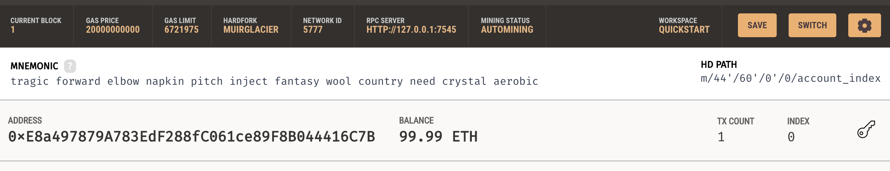
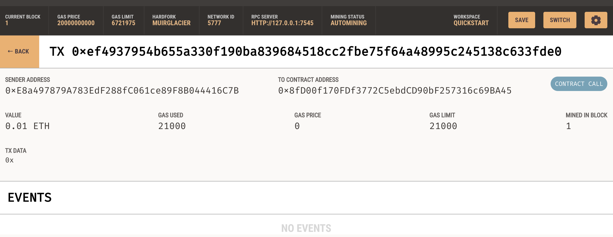

# Challenge_19
Fintech Finder - Find, Hire and Pay using the Ethereum Blockchain

The goal of this project was to build a web application that would allow you to find and hire a fintech professional and then pay them through the Ethereum blockchain. In order to do this, the project uses a locally generated instance of the Ethereum blockchain generate through the Ganache application. Then, using streamlit, a web application is run which allows a user to browse professionals, select one to hire and for how long and then send the necessary transaction.

---

## Technologies

This project is built in Python 3.6 and designed to be run using the command line. In order to properly utilize the project, the following Python libraries will be imported and used:

   [web3](https://web3py.readthedocs.io/en/stable/)

   [streamlit](https://docs.streamlit.io/)

   [typing](https://docs.python.org/3/library/typing.html)
   
   [bip44](https://pypi.org/project/bip44/)
   
   [dataclasses](https://docs.python.org/3/library/dataclasses.html)
   
   [os](https://docs.python.org/3/library/os.html)
   
   [requests](https://docs.python-requests.org/en/latest/)


---

## Installation Guide

In order to best install all the required libraries, a new conda environment should be created using the command line and then the installs can be done. This can be completed using the following commands

```python
conda create -n wallet python=3.7 anaconda -y
conda activate wallet
conda install ipykernel
conda install nb_conda_kernels
conda update conda
pip install web3==5.17
pip install eth-tester==0.5.0b3
pip install mnemonic
pip install bip44
pip install streamlit
```

Additionally, the Ganache application can be installed using the following link:

  [Ganache](https://trufflesuite.com/ganache/)

---

## Usage

Once the streamlit library has been installed into a Python environment, the user can run the project by navigating into the Challenge_19 directory using the command line. The user also needs to open and create a new blockchain instance using Ganache. Then the generated menmonic from Ganache must be placed into a .env file. With these steps completed, the user can run the following command to deploy the application: 

```python
streamlit run fintech_finder.py
```


---

## Ganache Account Following Transaction




---

## Ganache Transaction




---

## Contributors

Briggs Lalor
email: briggsclalor@gmail.com

---

## License

MIT License

Copyright (c) [2021] [Briggs Lalor]

Permission is hereby granted, free of charge, to any person obtaining a copy
of this software and associated documentation files (the "Software"), to deal
in the Software without restriction, including without limitation the rights
to use, copy, modify, merge, publish, distribute, sublicense, and/or sell
copies of the Software, and to permit persons to whom the Software is
furnished to do so, subject to the following conditions:

The above copyright notice and this permission notice shall be included in all
copies or substantial portions of the Software.

THE SOFTWARE IS PROVIDED "AS IS", WITHOUT WARRANTY OF ANY KIND, EXPRESS OR
IMPLIED, INCLUDING BUT NOT LIMITED TO THE WARRANTIES OF MERCHANTABILITY,
FITNESS FOR A PARTICULAR PURPOSE AND NONINFRINGEMENT. IN NO EVENT SHALL THE
AUTHORS OR COPYRIGHT HOLDERS BE LIABLE FOR ANY CLAIM, DAMAGES OR OTHER
LIABILITY, WHETHER IN AN ACTION OF CONTRACT, TORT OR OTHERWISE, ARISING FROM,
OUT OF OR IN CONNECTION WITH THE SOFTWARE OR THE USE OR OTHER DEALINGS IN THE
SOFTWARE.
